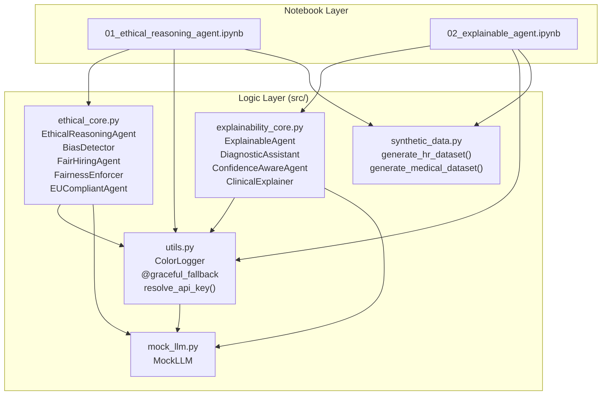

# Chapter 12: Ethical and Explainable Agents

**Book:** *30 Agents Every AI Engineer Must Build*
**Author:** Imran Ahmad
**Publisher:** Packt Publishing (2026)
**Chapter:** 12 — Ethical and Explainable Agents

---

## Overview

This repository contains the complete companion code for Chapter 12, which builds two complementary agent architectures:

1. **Ethical Reasoning Agent** — Integrates value alignment, ethical decision-making, and bias mitigation directly into the agent's reasoning pipeline. Every candidate action is evaluated against deontic logic constraints, fairness metrics, and regulatory requirements before execution. Includes a full HR Assistant case study with a three-layer fairness architecture (anonymization → bias detection → enforcement).

2. **Explainable Agent** — Makes internal reasoning visible to users, auditors, and regulators through structured explanation frameworks and calibrated confidence communication. Implements LIME, SHAP, and counterfactual analysis with audience-adapted output. Includes a Medical Diagnosis Assistant case study with multi-source evidence integration.

Both architectures are grounded in the IEEE Ethically Aligned Design framework, the EU AI Act compliance requirements, and the Impossibility Theorem for fairness metric selection.

## Architecture



## Setup

### Prerequisites

- Python 3.10 or later
- pip package manager

### Installation

```bash
# Clone the repository
git clone https://github.com/PacktPublishing/30-Agents-Every-AI-Engineer-Must-Build.git
cd chapter12

# Create a virtual environment (recommended)
python -m venv .venv
source .venv/bin/activate  # Linux/macOS
# .venv\Scripts\activate   # Windows

# Install dependencies
pip install -r requirements.txt
```

### API Key Configuration (Optional)

The repository runs in **Simulation Mode** by default — no API key is required. All outputs use chapter-derived mock data with deterministic results.

To enable **Live Mode** with OpenAI's gpt-4o model:

```bash
cp .env.template .env
# Edit .env and add your key: OPENAI_API_KEY=sk-...
```

### Running the Notebooks

```bash
# Launch Jupyter
jupyter notebook notebooks/

# Or run in VS Code with the Jupyter extension
```

## Simulation Mode

When no valid OpenAI API key is detected, the repository automatically activates Simulation Mode. In this mode:

- All LLM calls are routed to `MockLLM`, which returns chapter-derived responses
- Synthetic datasets are generated deterministically (seed=42)
- All fairness metrics, SHAP values, and explanations match the chapter examples
- Color-coded logs display in blue to indicate simulation status

This ensures every notebook cell executes without error and produces meaningful, educational output regardless of API access.

## Notebooks

| Notebook | Chapter Sections | Key Topics |
|---|---|---|
| `01_ethical_reasoning_agent.ipynb` | p.3–23 | Deontic logic, value alignment, Impossibility Theorem, bias detection and mitigation, FairHiringAgent HR case study |
| `02_explainable_agent.ipynb` | p.23–39 | Reasoning transparency, LIME/SHAP, counterfactual analysis, confidence calibration, DiagnosticAssistant medical case study |

## Project Structure

```
chapter12-ethical-explainable-agents/
├── README.md                          # This file
├── AGENTS.md                          # Agentic metadata and persona definition
├── LICENSE                            # MIT License
├── requirements.txt                   # Pinned dependencies
├── .env.template                      # API key placeholder
├── .gitignore                         # Git exclusions
├── notebooks/
│   ├── 01_ethical_reasoning_agent.ipynb  # Ethical Reasoning Agent walkthrough
│   └── 02_explainable_agent.ipynb       # Explainable Agent walkthrough
├── src/
│   ├── __init__.py                    # Package exports
│   ├── mock_llm.py                    # Context-aware mock LLM for Simulation Mode
│   ├── ethical_core.py                # Ethical reasoning classes and bias pipeline
│   ├── explainability_core.py         # Explanation frameworks and diagnostic assistant
│   ├── utils.py                       # ColorLogger, decorators, mode detection
│   └── synthetic_data.py             # Deterministic dataset generators
├── data/
│   └── .gitkeep                       # Generated datasets stored here
└── docs/
    └── TROUBLESHOOTING.md             # Dependency and runtime issue resolution
```

## Key Concepts Covered

- **Deontic Logic** — Obligation, permission, and prohibition operators with three axioms (p.5–7)
- **Ethical Consistency Theorem** — Formal permissibility criterion for agent actions (p.7)
- **IEEE Ethically Aligned Design** — Modular validators for human rights, well-being, accountability (p.8–9)
- **EU AI Act Compliance** — Seven-requirement compliance control plane (p.10–11)
- **Impossibility Theorem** — Mathematical proof that statistical parity, equal opportunity, and predictive parity cannot all hold simultaneously (p.12–13)
- **Bias Detection Pipeline** — Demographic parity, equal opportunity, disparate impact with four-fifths rule (p.14–19)
- **LIME and SHAP** — Local and global model-agnostic explanation frameworks (p.26)
- **Counterfactual Analysis** — Minimal change explanations for recourse generation (p.27)
- **Confidence Calibration** — Epistemic vs. aleatoric uncertainty with temperature scaling (p.27–30)
- **Audience-Adapted Explanations** — Clinician vs. patient explanation templates (p.34–35)

## Troubleshooting

See [docs/TROUBLESHOOTING.md](docs/TROUBLESHOOTING.md) for solutions to common dependency conflicts and runtime issues.

## License

This project is licensed under the MIT License. See [LICENSE](LICENSE) for details.

## Author

**Imran Ahmad** — Packt Publishing, 2026

For the complete book, visit: [30 Agents Every AI Engineer Must Build](https://github.com/PacktPublishing/30-Agents-Every-AI-Engineer-Must-Build)
