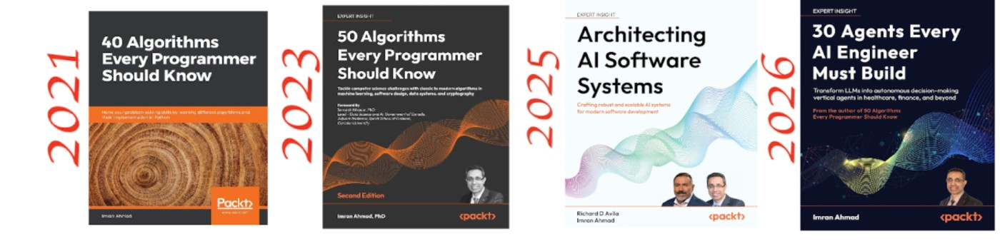
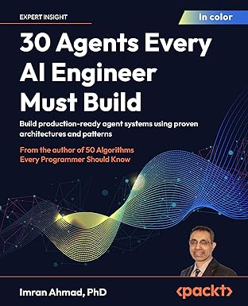

# 30 Agents Every AI Engineer Must Build

<a href="https://www.amazon.com/Agents-Every-Engineer-Must-Build/dp/1806109018/ref=sr_1_1?crid=1AESLY0JL95NZ&dib=eyJ2IjoiMSJ9.mmgKkt8jTbpK__ifx3V1MwRYgFwwZicYOQG3zZYSkklSgx7AL2WpW9XJ9No_EjMMnrvw8OQryZ432b8D35N_o84BC7Mffvcf3fI88nJjPu4_NKL1lKn6FE7YH2zZ71PN1kihNO2WOKVcRiyuOlqNq3aSsefSaNIAg7qd9mjbUdCWbdGHUG-onFrgY-wm1QiGhmh6euxsYyo3vBEcLCRWou75m8dIKBbtKDair4ZUe-w.aqhF37h6emt18J8IQQRJH5J3uwAR6q_cfeFlm12rTIA&dib_tag=se&keywords=30+agents+every+ai+engineer+must+build&qid=1775221676&sprefix=30+agent%2Caps%2C114&sr=8-1"></a>

**Build production-ready agent systems using proven architectures and patterns**

*From the author of [50 Algorithms Every Programmer Should Know](https://www.amazon.com/Algorithms-Every-Programmer-Should-Know/dp/1803247762)*

**Author:** Imran Ahmad, PhD  
**Publisher:** [Packt Publishing](https://www.packtpub.com/), 2026  

[](https://www.amazon.com/Agents-Every-Engineer-Must-Build/dp/1806109018/ref=sr_1_1?crid=1AESLY0JL95NZ&dib=eyJ2IjoiMSJ9.mmgKkt8jTbpK__ifx3V1MwRYgFwwZicYOQG3zZYSkklSgx7AL2WpW9XJ9No_EjMMnrvw8OQryZ432b8D35N_o84BC7Mffvcf3fI88nJjPu4_NKL1lKn6FE7YH2zZ71PN1kihNO2WOKVcRiyuOlqNq3aSsefSaNIAg7qd9mjbUdCWbdGHUG-onFrgY-wm1QiGhmh6euxsYyo3vBEcLCRWou75m8dIKBbtKDair4ZUe-w.aqhF37h6emt18J8IQQRJH5J3uwAR6q_cfeFlm12rTIA&dib_tag=se&keywords=30+agents+every+ai+engineer+must+build&qid=1775221676&sprefix=30+agent%2Caps%2C114&sr=8-1)

---

## About This Book

The AI landscape is shifting from passive, reactive systems to autonomous, goal-directed intelligent agents—systems that perceive their environment, make decisions, and take actions with minimal human intervention. This book presents **30 essential agent architectures** that every AI engineer must master to build effective, production-ready systems.

Raw LLMs alone are not enough. The key to building transformative AI systems lies in understanding how to architect agents that decompose complex tasks, connect to external tools and data sources, maintain memory across interactions, collaborate with humans and other agents, learn from experience, and make ethical decisions aligned with human values.

Each chapter includes **working code**, **formal architectural patterns**, **real-world case studies**, and guidance on avoiding common implementation pitfalls. Every pattern has been tested against the production realities of latency, cost, reliability, and security that define real-world deployments.

## Who This Book Is For

This book is for **AI engineers**, **software developers**, **ML researchers**, and **technical leads** building intelligent systems. It's ideal for those deploying LLM-powered applications or transitioning from traditional ML to agentic frameworks. Python experience and basic ML knowledge are recommended.

---

## Quick Start

```bash
# Clone the repository
git clone https://github.com/PacktPublishing/30-Agents-Every-AI-Engineer-Must-Build.git
cd 30-Agents-Every-AI-Engineer-Must-Build

# Navigate to a chapter
cd chapter05

# Install dependencies
pip install -r requirements.txt

# Run the examples
python autonomous_decision_agent.py
```

### Software and Hardware Requirements

| Requirement | Details |
|---|---|
| **OS** | macOS, Windows, or Linux |
| **RAM** | 8 GB minimum; 16 GB recommended |
| **Python** | 3.10 or later |
| **GPU** | NVIDIA GPU with CUDA 12+ (recommended, not required) |
| **Tools** | git, terminal, virtual environment tool (venv, conda, or uv) |
| **API Keys** | **None required** — every chapter runs in Simulation Mode with built-in MockLLM responses. Optional: OpenAI, Anthropic, or Hugging Face keys unlock Live Mode (varies by chapter) |

### Pre-Executed Example Notebooks

Every chapter includes **two pre-executed notebooks** so you can review the full output without running any code:

| File Pattern | Mode | Description |
|---|---|---|
| `EXAMPLE_RUN_SIMULATION_MODE_<notebook>.ipynb` | Simulation | Executed without an API key — all responses come from the chapter's MockLLM with pre-authored, curriculum-aligned output |
| `EXAMPLE_RUN_LLM_MODE_<notebook>.ipynb` | Live LLM | Executed with an OpenAI API key — all responses come from GPT-4o/GPT-4o-mini via the OpenAI API |

Both notebooks produce identical cell structure with different output — compare them side by side to see how Simulation Mode faithfully mirrors Live LLM behavior. This is useful for:

- **Reviewing output before installing dependencies** — browse the executed notebooks directly on GitHub
- **Comparing mock vs. live responses** — verify that Simulation Mode covers the same scenarios
- **Validating your own runs** — after executing a notebook, compare your output against the example runs

---

## Table of Contents

### Part 1: Agent Foundations and the Engineering Toolkit

Build the conceptual and practical foundation for designing, developing, and deploying intelligent agent systems. These chapters establish the theoretical vocabulary and engineering discipline that distinguish principled agent development from ad hoc prompt engineering.

| Chapter | Title | Topics | Real-World Use Case |
|---|---|---|---|
| [Chapter 01](https://github.com/PacktPublishing/30-Agents-Every-AI-Engineer-Must-Build/blob/main/chapter01/README.md) | **Foundations of Agent Engineering** | Evolution from rule-based to LLM-powered agents · Cognitive architecture · Agent Development Lifecycle · Progression Framework | — |
| [Chapter 02](https://github.com/PacktPublishing/30-Agents-Every-AI-Engineer-Must-Build/blob/main/chapter02/README.md) | **The Agent Engineer's Toolkit** | LangChain, LlamaIndex, AutoGPT · LLM selection · Vector databases · Tool integration · Cloud platforms | — |
| [Chapter 03](https://github.com/PacktPublishing/30-Agents-Every-AI-Engineer-Must-Build/blob/main/chapter03/README.md) | **The Art of Agent Prompting** | System prompts · Persona construction · Agent-to-agent protocols · Chain-of-thought · Prompt version control | — |
| [Chapter 04](https://github.com/PacktPublishing/30-Agents-Every-AI-Engineer-Must-Build/blob/main/chapter04/README.md) | **Agent Deployment and Responsible Development** | Infrastructure scaling · Cost management · Prompt injection defenses · Bias detection · Regulatory compliance | [NovaClaim Insurance](chapter04/USECASE.md) — Deploying AI agents for 40K claims/month |

### Part 2: Core Agent Architectures

Explore the fundamental agent architectures that serve as composable building blocks. Each architecture is designed to be combined with others to produce systems whose capabilities exceed the sum of their individual components.

| Chapter | Title | Agents Covered | Real-World Use Case |
|---|---|---|---|
| [Chapter 05](https://github.com/PacktPublishing/30-Agents-Every-AI-Engineer-Must-Build/blob/main/chapter05/README.md) | **Foundational Cognitive Architectures** | The Autonomous Decision-Making Agent · The Planning Agent · The Memory-Augmented Agent | — |
| [Chapter 06](https://github.com/PacktPublishing/30-Agents-Every-AI-Engineer-Must-Build/blob/main/chapter06/README.md) | **Information Retrieval and Knowledge Agents** | The Knowledge Retrieval Agent (advanced RAG) · The Document Intelligence Agent · The Scientific Research Agent | — |
| [Chapter 07](https://github.com/PacktPublishing/30-Agents-Every-AI-Engineer-Must-Build/blob/main/chapter07/README.md) | **Tool Manipulation and Orchestration Agents** | The Tool-Using Agent · The Chain-of-Agents Orchestrator · The Agentic Workflow System | [ShieldPoint Insurance](chapter07/USECASE.md) — 5-agent claims pipeline cutting cycle time from 12 days to 3.5 |
| [Chapter 08](https://github.com/PacktPublishing/30-Agents-Every-AI-Engineer-Must-Build/blob/main/chapter08/README.md) | **Data Analysis and Reasoning Agents** | The Data Analysis Agent · The Verification and Validation Agent · The General Problem Solver | — |

### Part 3: Specialized Application Agents

Extend core architectures into domains with stringent requirements for reliability, safety, and domain expertise. Each chapter includes production deployment considerations, a working codebase, and a [real-world use case study](chapter09/USECASE.md) with fictional companies, stakeholder profiles, and revenue impact analysis.

| Chapter | Title | Agents Covered | Real-World Use Case |
|---|---|---|---|
| [Chapter 09](https://github.com/PacktPublishing/30-Agents-Every-AI-Engineer-Must-Build/blob/main/chapter09/README.md) | **Software Development Agents** | The Code-Generation Agent · The Security-Hardened Agent · The Self-Improving Agent | [VaultPay](chapter09/USECASE.md) — Fintech startup catching PCI violations in CI/CD and fixing a declining support chatbot |
| [Chapter 10](https://github.com/PacktPublishing/30-Agents-Every-AI-Engineer-Must-Build/blob/main/chapter10/README.md) | **Conversational and Content Creation Agents** | The Conversational Agent · The Content Creation Agent · The Recommendation Agent | [MindBridge Health](chapter10/USECASE.md) — Campus wellness platform with crisis-safe chatbot serving 31K students |
| [Chapter 11](https://github.com/PacktPublishing/30-Agents-Every-AI-Engineer-Must-Build/blob/main/chapter11/README.md) | **Multi-Modal Perception Agents** | The Vision-Language Agent · The Audio Processing Agent · The Physical World Sensing Agent | [Meridian Facilities](chapter11/USECASE.md) — 22-building smart property management with 17% energy reduction |
| [Chapter 12](https://github.com/PacktPublishing/30-Agents-Every-AI-Engineer-Must-Build/blob/main/chapter12/README.md) | **Ethical and Explainable Agents** | The Ethical Reasoning Agent · The Explainable Agent | [TalentForward + ClearPath Health](chapter12/USECASE.md) — Fair hiring (DI 0.73 → 0.80+) and explainable clinical diagnosis |

### Part 4: Domain-Specific Agent Systems with Real-World Use Cases

Apply the full range of agent architectures to transform professional domains where complexity, regulation, and human impact are most acute. Each chapter includes a detailed [use case study](chapter13/USECASE.md) with a fictional company navigating real industry constraints — failed alternatives, regulatory requirements, revenue impact, and a step-by-step mapping of how the code solves each problem.

| Chapter | Title | Agents Covered | Real-World Use Case |
|---|---|---|---|
| [Chapter 13](https://github.com/PacktPublishing/30-Agents-Every-AI-Engineer-Must-Build/blob/main/chapter13/README.md) | **Healthcare and Scientific Agents** | The Healthcare Intelligence Agent · The Scientific Discovery Agent | [Pinnacle Health + NovaMateria Labs](chapter13/USECASE.md) — Bayesian sepsis detection cutting missed cases by 79%; materials discovery compressed 60% |
| [Chapter 14](https://github.com/PacktPublishing/30-Agents-Every-AI-Engineer-Must-Build/blob/main/chapter14/README.md) | **Financial and Legal Domain Agents** | The Financial Advisory Agent · The Legal Intelligence Agent | [Meridian Wealth + Cartwright Legal](chapter14/USECASE.md) — Compliance-by-architecture for $2.8B RIA; hallucination-proof legal research |
| [Chapter 15](https://github.com/PacktPublishing/30-Agents-Every-AI-Engineer-Must-Build/blob/main/chapter15/README.md) | **Education and Knowledge Agents** | The Education Intelligence Agent · The Collective Intelligence Agent | [LearnPath](chapter15/USECASE.md) — Adaptive Python tutor raising completion from 52% to 78% across 12K learners |
| [Chapter 16](https://github.com/PacktPublishing/30-Agents-Every-AI-Engineer-Must-Build/blob/main/chapter16/README.md) | **Embodied and Physical World Agents** | The Embodied Intelligence Agent · The Domain-Transforming Integration Agent | [ArcticWing Aerial](chapter16/USECASE.md) — Autonomous drone ops in Ottawa winter, scrub rate 38% → 14% |
| Epilogue | **The Future of Intelligent Agents** | Autonomous agent evolution · Agent societies and emergent behaviors · Brain-inspired cognitive architectures | — |

## Chapter Structure

Each chapter follows a consistent six-part structure designed for both learning and reference:

1. **Conceptual Foundation** — Core principles and architectural patterns
2. **Implementation Guide** — Detailed code examples highlighting essential components
3. **Case Studies** — Real-world applications solving practical problems
4. **Design Patterns and Variations** — Alternative approaches for different contexts
5. **Integration Considerations** — Combining agents into more powerful systems
6. **Common Pitfalls** — Avoiding typical implementation mistakes

---

## How to Use This Book

This book accommodates three distinct reading approaches:

- **Sequential:** Chapters 1–4 → 5–12 → 13–16 → Epilogue (full foundation to specialization)
- **Domain-Focused:** Start with Chapters 1–4 for foundations, then jump directly to your industry vertical:

  | If you work in... | Start here | Then explore |
  |---|---|---|
  | **Healthcare** | Ch 13 (Bayesian diagnosis, scientific discovery) | Ch 12 (explainability, fairness) → Ch 11 (medical imaging) |
  | **Finance or Legal** | Ch 14 (portfolio advisory, contract analysis) | Ch 4 (cost management, compliance) → Ch 12 (audit trails) |
  | **Insurance** | Ch 7 (claims workflow, HITL escalation) | Ch 4 (deployment patterns) → Ch 9 (compliance scanning) |
  | **Education** | Ch 15 (adaptive tutoring, knowledge tracing) | Ch 10 (conversational agents) → Ch 9 (self-improving agents) |
  | **Software Engineering** | Ch 9 (code generation, PCI/HIPAA scanning) | Ch 7 (tool orchestration) → Ch 12 (explainable decisions) |
  | **Facilities / IoT** | Ch 11 (sensor fusion, proportional control) | Ch 8 (data analysis) → Ch 7 (workflow automation) |
  | **Robotics / Drones** | Ch 16 (safety envelopes, cascade analysis) | Ch 11 (perception agents) → Ch 4 (resilience patterns) |

- **Reference:** Look up specific agent architectures as needed for particular projects

---

## The 30 Agents at a Glance

| # | Agent | Chapter |
|:---:|---|---|
| 1 | [The Autonomous Decision-Making Agent](chapter05/ch05_foundational_architectures.ipynb) | Ch 5: Foundational Cognitive Architectures |
| 2 | [The Planning Agent](chapter05/ch05_foundational_architectures.ipynb) | Ch 5: Foundational Cognitive Architectures |
| 3 | [The Memory-Augmented Agent](chapter05/ch05_foundational_architectures.ipynb) | Ch 5: Foundational Cognitive Architectures |
| 4 | [The Knowledge Retrieval Agent](chapter06/chapter_06_knowledge_agents.ipynb) | Ch 6: Information Retrieval & Knowledge Agents |
| 5 | [The Document Intelligence Agent](chapter06/chapter_06_knowledge_agents.ipynb) | Ch 6: Information Retrieval & Knowledge Agents |
| 6 | [The Scientific Research Agent](chapter06/chapter_06_knowledge_agents.ipynb) | Ch 6: Information Retrieval & Knowledge Agents |
| 7 | [The Tool-Using Agent](chapter07/Chapter_07_Tool_Orchestration.ipynb) | Ch 7: Tool Manipulation & Orchestration Agents |
| 8 | [The Chain-of-Agents Orchestrator](chapter07/Chapter_07_Tool_Orchestration.ipynb) | Ch 7: Tool Manipulation & Orchestration Agents |
| 9 | [The Agentic Workflow System](chapter07/Chapter_07_Tool_Orchestration.ipynb) | Ch 7: Tool Manipulation & Orchestration Agents |
| 10 | [The Data Analysis Agent](chapter08/ch08_data_analysis_reasoning_agents.ipynb) | Ch 8: Data Analysis & Reasoning Agents |
| 11 | [The Verification and Validation Agent](chapter08/ch08_data_analysis_reasoning_agents.ipynb) | Ch 8: Data Analysis & Reasoning Agents |
| 12 | [The General Problem Solver](chapter08/ch08_data_analysis_reasoning_agents.ipynb) | Ch 8: Data Analysis & Reasoning Agents |
| 13 | [The Code-Generation Agent](chapter09/ch09_software_dev_agents.ipynb) | Ch 9: Software Development Agents |
| 14 | [The Security-Hardened Agent](chapter09/ch09_software_dev_agents.ipynb) | Ch 9: Software Development Agents |
| 15 | [The Self-Improving Agent](chapter09/ch09_software_dev_agents.ipynb) | Ch 9: Software Development Agents |
| 16 | [The Conversational Agent](chapter10/Chapter_10_Conversational_and_Content_Creation_Agents.ipynb) | Ch 10: Conversational & Content Creation Agents |
| 17 | [The Content Creation Agent](chapter10/Chapter_10_Conversational_and_Content_Creation_Agents.ipynb) | Ch 10: Conversational & Content Creation Agents |
| 18 | [The Recommendation Agent](chapter10/Chapter_10_Conversational_and_Content_Creation_Agents.ipynb) | Ch 10: Conversational & Content Creation Agents |
| 19 | [The Vision-Language Agent](chapter11/chapter_11_multimodal_agents.ipynb) | Ch 11: Multi-Modal Perception Agents |
| 20 | [The Audio Processing Agent](chapter11/chapter_11_multimodal_agents.ipynb) | Ch 11: Multi-Modal Perception Agents |
| 21 | [The Physical World Sensing Agent](chapter11/chapter_11_multimodal_agents.ipynb) | Ch 11: Multi-Modal Perception Agents |
| 22 | [The Ethical Reasoning Agent](chapter12/01_ethical_reasoning_agent.ipynb) | Ch 12: Ethical & Explainable Agents |
| 23 | [The Explainable Agent](chapter12/02_explainable_agent.ipynb) | Ch 12: Ethical & Explainable Agents |
| 24 | [The Healthcare Intelligence Agent](chapter13/chapter13_healthcare_scientific_agents.ipynb) | Ch 13: Healthcare & Scientific Agents |
| 25 | [The Scientific Discovery Agent](chapter13/chapter13_healthcare_scientific_agents.ipynb) | Ch 13: Healthcare & Scientific Agents |
| 26 | [The Financial Advisory Agent](chapter14/chapter14_financial_legal_agents.ipynb) | Ch 14: Financial & Legal Domain Agents |
| 27 | [The Legal Intelligence Agent](chapter14/chapter14_financial_legal_agents.ipynb) | Ch 14: Financial & Legal Domain Agents |
| 28 | [The Education Intelligence Agent](chapter15/chapter15_education_and_knowledge_agents.ipynb) | Ch 15: Education & Knowledge Agents |
| 29 | [The Collective Intelligence Agent](chapter15/chapter15_education_and_knowledge_agents.ipynb) | Ch 15: Education & Knowledge Agents |
| 30 | [The Embodied Intelligence Agent](chapter16/chapter16_embodied_agents.ipynb) | Ch 16: Embodied & Physical World Agents |

---

## About the Author

 [Imran Ahmad on LinkedIn](https://www.linkedin.com/in/cloudanum/)


**Imran Ahmad, PhD** is a data scientist at the Advanced Analytics Solution Center (A2SC) within the Canadian Federal Government, where he builds and deploys machine learning systems for mission-critical applications. In his 2010 doctoral thesis, he introduced a linear programming-based algorithm for optimal resource assignment in large-scale cloud computing environments. In 2017, he pioneered the development of StreamSensing, a real-time analytics framework that has become the foundation of several research papers on processing multimedia data within machine learning paradigms.

Dr. Ahmad holds a visiting professorship at Carleton University in Ottawa and is an authorized instructor for Google Cloud and Microsoft Azure. He is the author of the bestselling *[50 Algorithms Every Programmer Should Know](https://www.amazon.com/Algorithms-Every-Programmer-Should-Know/dp/1803247762)* (Packt Publishing, Second Edition 2023), which has been widely adopted in both academic curricula and industry training programs. Every pattern in this book has been tested against the production realities of latency, cost, reliability, and security that define real-world deployments.

---

## Get in Touch

- **General feedback:** Email [customercare@packt.com](mailto:customercare@packt.com) with the book title in the subject line.
- **Code issues:** Open an issue on this repository.
- **Author:** Connect with [Imran Ahmad on LinkedIn](https://www.linkedin.com/in/cloudanum/)
